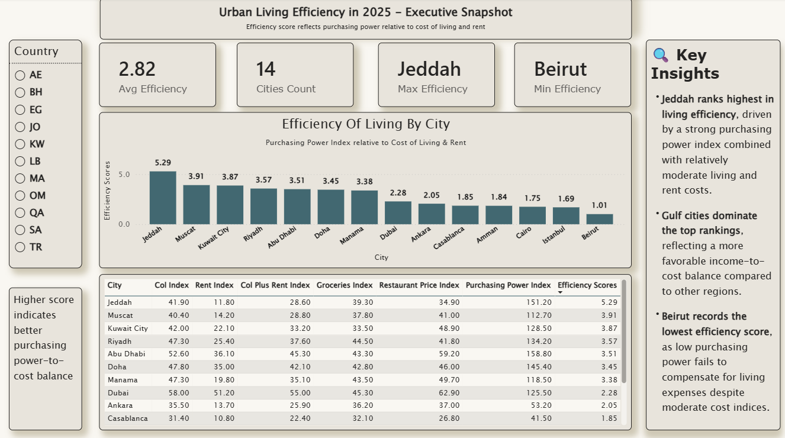

# 🌆 Urban Living Efficiency in 2025 – MENA Cities

## 📌 Overview
This project analyzes **urban living efficiency** across selected MENA cities in 2025 by evaluating how effectively **purchasing power** offsets **cost of living and rent**.

The analysis provides a **comparative, data-driven perspective** to support insights into regional income-to-cost balance.

---

## 📐 Efficiency Metric
The core metric used in this project is:

**Efficiency Score = Purchasing Power Index / (Cost of Living + Rent Index)**

🔹 Higher score → stronger income-to-cost balance  
🔹 Lower score → living expenses outweigh purchasing power

---

## 🗂️ Data Source
- **Source:** Numbeo (2025 snapshot)
- **Region:** MENA
- **Cities Covered:** 14
- **Key Indices Used:**
  - Cost of Living Index  
  - Rent Index  
  - Cost of Living + Rent Index  
  - Groceries Index  
  - Restaurant Price Index  
  - Purchasing Power Index  

---

## 🔍 Methodology (Brief)
1. Data extraction and validation from Numbeo
2. Computation of efficiency score per city
3. City ranking based on efficiency
4. Comparative cost structure analysis
5. Visualization using an executive-level Power BI dashboard

---

## 📊 Dashboard Preview

---

## 💡 Key Insights
- **Jeddah ranks highest** in living efficiency, driven by strong purchasing power combined with moderate living and rent costs.
- **Gulf cities dominate top rankings**, indicating a more favorable income-to-cost balance.
- **Beirut records the lowest efficiency score**, as purchasing power remains insufficient to offset living expenses.

---

## 🛠️ Tools & Technologies
- 🐍 Python (pandas, numpy)
- 📊 Power BI
- 📓 Jupyter Notebook

---

## 📁 Project Structure
- `/notebooks` → data analysis and calculations  
- `/dashboard` → Power BI dashboard file  
- `/data` → data
- `/images` → dashboard screenshots  

---

## ℹ️ Notes
This project is intended for **comparative analytical insights**, not absolute cost rankings, and reflects Numbeo data availability at the time of extraction.

---

## 👤 Author
### Asem Haij

#### GitHub: https://github.com/ProfASEM
#### LinkedIn: www.linkedin.com/in/asem-haij-9797562a8
